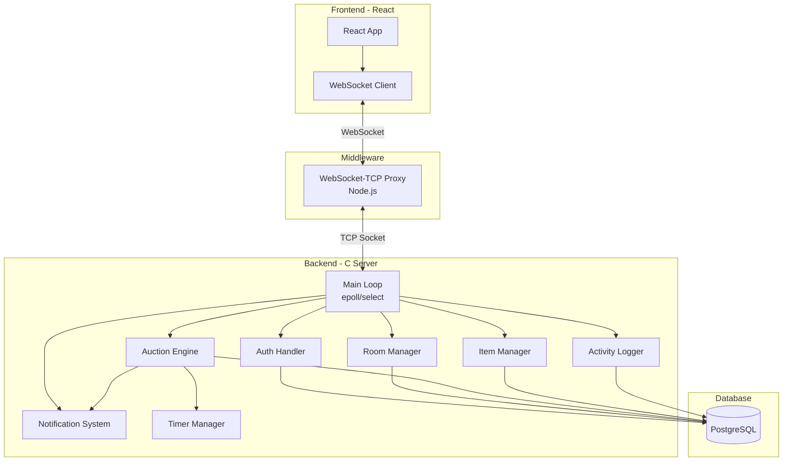
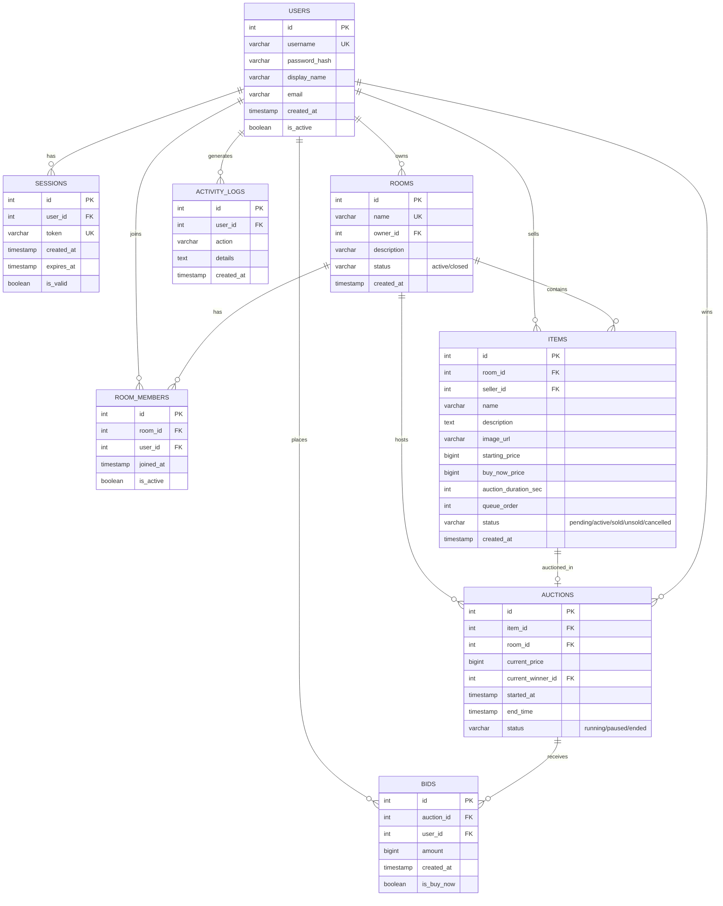
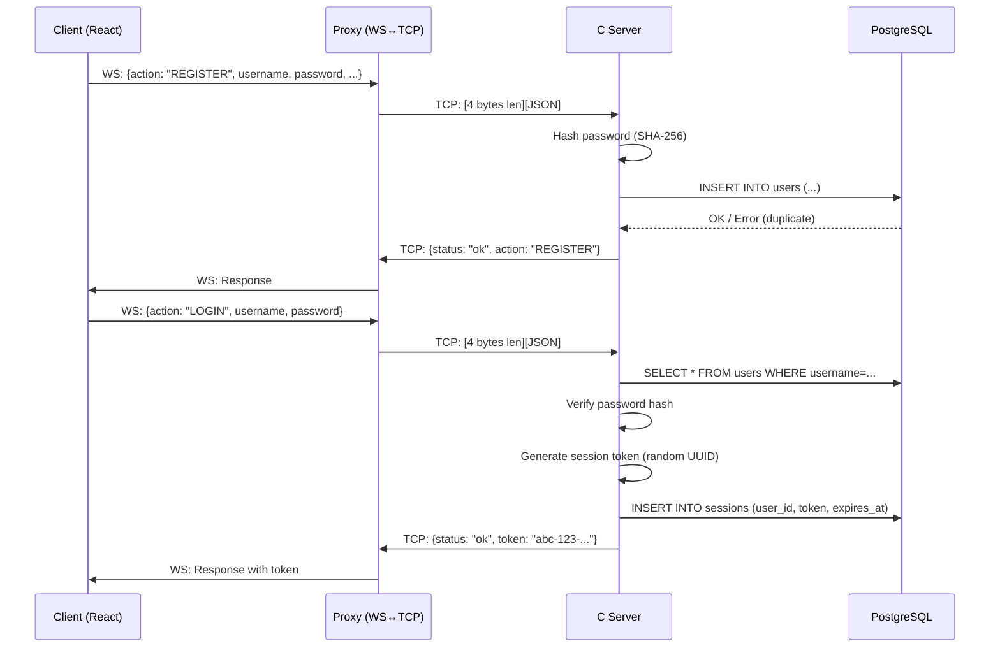
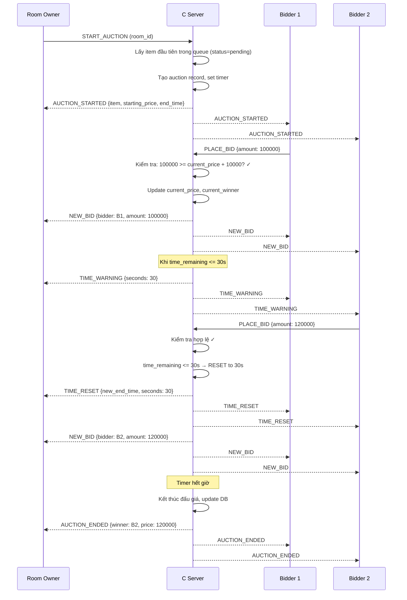
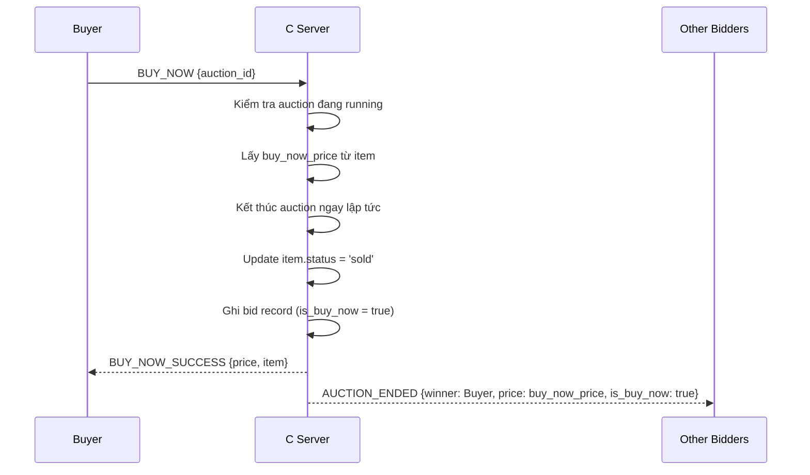

# Hệ Thống Đấu Giá Trực Tuyến — Kế Hoạch Triển Khai Chi Tiết

## 1. Giải Thích Các Khái Niệm Quan Trọng

### 1.1. Xử Lý Truyền Dòng (Stream Processing) — 1 điểm

TCP là giao thức **truyền dòng** (byte stream), nghĩa là dữ liệu gửi đi không có ranh giới rõ ràng giữa các message. Ví dụ:

```
Client gửi 2 lần:  "HELLO\n"  rồi  "BID 50000\n"
Server có thể nhận: "HELLO\nBID 5"  rồi  "0000\n"   ← dữ liệu bị chia cắt!
```

**Giải pháp**: Cần một **giao thức framing** để tách các message:
- **Cách 1 — Delimiter**: Dùng ký tự `\n` làm ranh giới → đọc từng byte cho đến khi gặp `\n` thì coi là 1 message hoàn chỉnh.
- **Cách 2 — Length-prefix**: Gửi 4 byte đầu chứa độ dài message, rồi đến nội dung → server đọc 4 byte trước, biết cần đọc thêm bao nhiêu byte.

**Trong project này**, ta dùng **JSON + length-prefix**:
```
[4 bytes: message length][JSON payload]
```

```c
// Gửi message
void send_message(int sockfd, const char *json_str) {
    uint32_t len = htonl(strlen(json_str));  // network byte order
    send(sockfd, &len, 4, 0);                // gửi 4 byte độ dài
    send(sockfd, json_str, strlen(json_str), 0); // gửi nội dung
}

// Nhận message — phải đọc đủ n bytes (xử lý partial read)
int recv_exact(int sockfd, char *buf, int n) {
    int total = 0;
    while (total < n) {
        int received = recv(sockfd, buf + total, n - total, 0);
        if (received <= 0) return -1;  // lỗi hoặc disconnect
        total += received;
    }
    return total;
}
```

### 1.2. Cài Đặt Cơ Chế Vào/Ra Socket Trên Server (I/O Multiplexing) — 2 điểm

Server phải phục vụ **nhiều client đồng thời**. Có 3 cách:

| Phương pháp | Mô tả | Ưu/Nhược |
|---|---|---|
| **Multi-thread** | Mỗi client 1 thread | Đơn giản, tốn tài nguyên |
| **`select()`** | Kiểm tra nhiều socket cùng lúc | Portable, giới hạn FD_SETSIZE |
| **`epoll()`** (Linux) | Event-driven I/O | Hiệu năng cao, chỉ chạy trên Linux |

**Trong project này**, ta dùng kết hợp: **`epoll()` (hoặc `select()`) + thread pool**:

```
                    ┌─────────────────────────────────┐
                    │          Main Thread             │
                    │    epoll_wait() / select()       │
                    │  Lắng nghe sự kiện trên tất      │
                    │  cả socket (new conn + data)     │
                    └────────────┬────────────────────┘
                                 │ có sự kiện
                    ┌────────────▼────────────────────┐
                    │        Event Dispatcher          │
                    │  - New connection → accept()     │
                    │  - Data ready → đọc message      │
                    │  - Dispatch tới handler           │
                    └────────────┬────────────────────┘
                                 │
              ┌──────────────────┼──────────────────┐
              ▼                  ▼                   ▼
        ┌──────────┐      ┌──────────┐        ┌──────────┐
        │ Worker 1 │      │ Worker 2 │        │ Worker N │
        │ (thread) │      │ (thread) │        │ (thread) │
        └──────────┘      └──────────┘        └──────────┘
```

### 1.3. Cách Client (React) Giao Tiếp Với Server (C)

Vì server C dùng raw TCP socket, React (chạy trên browser) **không thể kết nối trực tiếp TCP**. Giải pháp:

```
┌──────────┐    WebSocket     ┌──────────────┐     TCP      ┌─────────────┐
│  React   │ ◄────────────► │  WebSocket    │ ◄──────────► │  C Server   │
│ Frontend │                 │  Proxy (Node) │              │  (Backend)  │
└──────────┘                 └──────────────┘              └─────────────┘
                                                                  │
                                                           ┌──────▼──────┐
                                                           │ PostgreSQL  │
                                                           └─────────────┘
```

**WebSocket Proxy** (Node.js nhỏ) làm cầu nối giữa WebSocket của browser và TCP socket của C server. Hoặc thay thế, ta có thể thêm **thư viện WebSocket vào C server** (dùng `libwebsockets`) để React kết nối trực tiếp.

> [!IMPORTANT]
> **Quyết định cần lựa chọn**: Dùng **WebSocket Proxy (Node.js)** hay tích hợp **libwebsockets vào C server**? Proxy đơn giản hơn nhưng thêm 1 layer. Tích hợp trực tiếp phức tạp hơn nhưng gọn.

---

## 2. Kiến Trúc Hệ Thống Tổng Quan



---

## 3. Thiết Kế Database (PostgreSQL)

### 3.1. Entity Relationship Diagram



### 3.2. SQL Schema

```sql
-- Bảng người dùng
CREATE TABLE users (
    id SERIAL PRIMARY KEY,
    username VARCHAR(50) UNIQUE NOT NULL,
    password_hash VARCHAR(255) NOT NULL,
    display_name VARCHAR(100) NOT NULL,
    email VARCHAR(100),
    created_at TIMESTAMP DEFAULT NOW(),
    is_active BOOLEAN DEFAULT TRUE
);

-- Bảng phiên đăng nhập
CREATE TABLE sessions (
    id SERIAL PRIMARY KEY,
    user_id INT REFERENCES users(id) ON DELETE CASCADE,
    token VARCHAR(255) UNIQUE NOT NULL,
    created_at TIMESTAMP DEFAULT NOW(),
    expires_at TIMESTAMP NOT NULL,
    is_valid BOOLEAN DEFAULT TRUE
);

-- Bảng phòng đấu giá
CREATE TABLE rooms (
    id SERIAL PRIMARY KEY,
    name VARCHAR(100) UNIQUE NOT NULL,
    owner_id INT REFERENCES users(id),
    description TEXT,
    status VARCHAR(20) DEFAULT 'active' CHECK (status IN ('active', 'closed')),
    created_at TIMESTAMP DEFAULT NOW()
);

-- Bảng thành viên phòng (mỗi user chỉ active trong 1 phòng tại 1 thời điểm)
CREATE TABLE room_members (
    id SERIAL PRIMARY KEY,
    room_id INT REFERENCES rooms(id) ON DELETE CASCADE,
    user_id INT REFERENCES users(id) ON DELETE CASCADE,
    joined_at TIMESTAMP DEFAULT NOW(),
    is_active BOOLEAN DEFAULT TRUE,
    -- Đảm bảo mỗi user chỉ active trong 1 phòng
    UNIQUE (user_id) WHERE (is_active = TRUE)  -- partial unique index
);

-- Tạo partial unique index riêng (PostgreSQL syntax)
CREATE UNIQUE INDEX idx_one_active_room_per_user 
    ON room_members (user_id) WHERE (is_active = TRUE);

-- Bảng vật phẩm đấu giá
CREATE TABLE items (
    id SERIAL PRIMARY KEY,
    room_id INT REFERENCES rooms(id) ON DELETE CASCADE,
    seller_id INT REFERENCES users(id),
    name VARCHAR(200) NOT NULL,
    description TEXT,
    image_url VARCHAR(500),
    starting_price BIGINT NOT NULL CHECK (starting_price > 0),
    buy_now_price BIGINT CHECK (buy_now_price > starting_price),
    auction_duration_sec INT NOT NULL DEFAULT 300,  -- 5 phút mặc định
    queue_order INT NOT NULL DEFAULT 0,
    status VARCHAR(20) DEFAULT 'pending' 
        CHECK (status IN ('pending', 'active', 'sold', 'unsold', 'cancelled')),
    created_at TIMESTAMP DEFAULT NOW()
);

-- Bảng phiên đấu giá
CREATE TABLE auctions (
    id SERIAL PRIMARY KEY,
    item_id INT REFERENCES items(id) UNIQUE,
    room_id INT REFERENCES rooms(id),
    current_price BIGINT NOT NULL,
    current_winner_id INT REFERENCES users(id),
    started_at TIMESTAMP DEFAULT NOW(),
    end_time TIMESTAMP NOT NULL,
    status VARCHAR(20) DEFAULT 'running'
        CHECK (status IN ('running', 'paused', 'ended'))
);

-- Bảng lệnh đặt giá
CREATE TABLE bids (
    id SERIAL PRIMARY KEY,
    auction_id INT REFERENCES auctions(id) ON DELETE CASCADE,
    user_id INT REFERENCES users(id),
    amount BIGINT NOT NULL,
    created_at TIMESTAMP DEFAULT NOW(),
    is_buy_now BOOLEAN DEFAULT FALSE
);

-- Bảng log hoạt động
CREATE TABLE activity_logs (
    id SERIAL PRIMARY KEY,
    user_id INT REFERENCES users(id),
    action VARCHAR(50) NOT NULL,
    details JSONB,
    created_at TIMESTAMP DEFAULT NOW()
);

-- Indexes cho performance
CREATE INDEX idx_items_room ON items(room_id);
CREATE INDEX idx_items_status ON items(status);
CREATE INDEX idx_auctions_room ON auctions(room_id);
CREATE INDEX idx_auctions_status ON auctions(status);
CREATE INDEX idx_bids_auction ON bids(auction_id);
CREATE INDEX idx_logs_user ON activity_logs(user_id);
CREATE INDEX idx_logs_created ON activity_logs(created_at);
```

---

## 4. Giao Thức Truyền Thông (Protocol)

### 4.1. Định Dạng Message

Mỗi message là JSON, được đóng gói với length-prefix:

```
┌──────────────────┬─────────────────────────────────────┐
│ 4 bytes (uint32) │         JSON payload                │
│ = payload length │                                     │
└──────────────────┴─────────────────────────────────────┘
```

### 4.2. Danh Sách Message Types

#### Client → Server (Request)

| Action | Payload | Mô tả |
|--------|---------|-------|
| `REGISTER` | `{username, password, display_name, email}` | Đăng ký tài khoản |
| `LOGIN` | `{username, password}` | Đăng nhập |
| `LOGOUT` | `{token}` | Đăng xuất |
| `CREATE_ROOM` | `{token, name, description}` | Tạo phòng đấu giá |
| `LIST_ROOMS` | `{token}` | Liệt kê phòng |
| `JOIN_ROOM` | `{token, room_id}` | Tham gia phòng |
| `LEAVE_ROOM` | `{token}` | Rời phòng |
| `ADD_ITEM` | `{token, room_id, name, desc, starting_price, buy_now_price, duration}` | Thêm vật phẩm |
| `DELETE_ITEM` | `{token, item_id}` | Xóa vật phẩm |
| `START_AUCTION` | `{token, room_id}` | Bắt đầu đấu giá item tiếp theo trong queue |
| `PLACE_BID` | `{token, auction_id, amount}` | Đặt giá |
| `BUY_NOW` | `{token, auction_id}` | Mua ngay |
| `LIST_ITEMS` | `{token, room_id, status_filter}` | Xem vật phẩm theo trạng thái |
| `SEARCH_ITEMS` | `{token, keyword, time_from, time_to}` | Tìm kiếm vật phẩm |
| `MY_STATS` | `{token}` | Xem thống kê cá nhân |

#### Server → Client (Response / Notification)

| Action | Payload | Mô tả |
|--------|---------|-------|
| `RESPONSE` | `{status, action, data, error}` | Phản hồi cho request |
| `AUCTION_STARTED` | `{auction_id, item, starting_price, end_time}` | Phiên đấu giá bắt đầu |
| `NEW_BID` | `{auction_id, bidder, amount, time_remaining}` | Có giá mới |
| `TIME_WARNING` | `{auction_id, seconds_remaining}` | Cảnh báo sắp hết giờ (30s) |
| `TIME_RESET` | `{auction_id, new_end_time, seconds_remaining}` | Reset thời gian về 30s |
| `AUCTION_ENDED` | `{auction_id, winner, final_price, item}` | Kết thúc đấu giá |
| `BUY_NOW_SUCCESS` | `{auction_id, buyer, price, item}` | Mua ngay thành công |
| `USER_JOINED` | `{room_id, user}` | Người dùng vào phòng |
| `USER_LEFT` | `{room_id, user}` | Người dùng rời phòng |

---

## 5. Cấu Trúc Thư Mục Project

```
auction-system/
├── server/                          # C Backend
│   ├── CMakeLists.txt               # Build system
│   ├── src/
│   │   ├── main.c                   # Entry point, khởi tạo server
│   │   ├── server.c/h               # Main event loop (epoll/select)
│   │   ├── network/
│   │   │   ├── socket_handler.c/h   # Accept, read, write socket
│   │   │   ├── message.c/h          # Đóng gói/giải mã message (framing)
│   │   │   └── protocol.c/h         # Parse JSON protocol
│   │   ├── handlers/
│   │   │   ├── auth_handler.c/h     # Đăng ký, đăng nhập, đăng xuất
│   │   │   ├── room_handler.c/h     # CRUD phòng đấu giá
│   │   │   ├── item_handler.c/h     # CRUD vật phẩm
│   │   │   ├── auction_handler.c/h  # Logic đấu giá, đặt giá, mua ngay
│   │   │   ├── search_handler.c/h   # Tìm kiếm vật phẩm
│   │   │   └── stats_handler.c/h    # Thống kê
│   │   ├── core/
│   │   │   ├── auction_engine.c/h   # Bộ máy đấu giá (timer, bid validation)
│   │   │   ├── room_manager.c/h     # Quản lý phòng & thành viên trong memory
│   │   │   ├── notification.c/h     # Broadcast thông báo
│   │   │   ├── timer.c/h            # Quản lý timer đấu giá (30s warning, reset)
│   │   │   └── logger.c/h           # Ghi log hoạt động
│   │   ├── db/
│   │   │   ├── database.c/h         # Kết nối PostgreSQL (libpq)
│   │   │   └── queries.c/h          # Prepared statements
│   │   └── utils/
│   │       ├── cJSON.c/h            # Thư viện parse JSON (open-source)
│   │       ├── hash.c/h             # Hash password (SHA-256)
│   │       └── config.c/h           # Đọc file config
│   ├── config/
│   │   └── server.conf              # Port, DB connection string, etc.
│   └── sql/
│       └── schema.sql               # Database schema
│
├── proxy/                           # WebSocket-TCP Proxy
│   ├── package.json
│   └── proxy.js                     # Node.js WebSocket ↔ TCP bridge
│
├── client/                          # React Frontend
│   ├── package.json
│   ├── vite.config.js
│   ├── public/
│   ├── src/
│   │   ├── main.jsx
│   │   ├── App.jsx
│   │   ├── index.css                # Global styles
│   │   ├── contexts/
│   │   │   ├── AuthContext.jsx      # Quản lý auth state
│   │   │   └── WebSocketContext.jsx # Quản lý WS connection
│   │   ├── hooks/
│   │   │   ├── useWebSocket.js      # Custom hook cho WS
│   │   │   └── useAuction.js        # Hook cho auction logic
│   │   ├── pages/
│   │   │   ├── LoginPage.jsx
│   │   │   ├── RegisterPage.jsx
│   │   │   ├── RoomListPage.jsx
│   │   │   ├── AuctionRoomPage.jsx
│   │   │   ├── SearchPage.jsx
│   │   │   └── StatsPage.jsx
│   │   └── components/
│   │       ├── Navbar.jsx
│   │       ├── RoomCard.jsx
│   │       ├── ItemCard.jsx
│   │       ├── BidPanel.jsx
│   │       ├── AuctionTimer.jsx
│   │       ├── ItemQueue.jsx
│   │       └── NotificationToast.jsx
│   └── ...
│
└── README.md
```

---

## 6. Luồng Hoạt Động Chính

### 6.1. Đăng Ký & Đăng Nhập



### 6.2. Phiên Đấu Giá



### 6.3. Mua Ngay (Buy Now)



---

## 7. Chi Tiết Triển Khai Từng Module

### 7.1. Server Core — Event Loop (`server.c`)

```c
// Pseudo-code cho main event loop
void server_run(int listen_fd) {
    int epoll_fd = epoll_create1(0);
    epoll_add(epoll_fd, listen_fd, EPOLLIN);

    while (running) {
        int n = epoll_wait(epoll_fd, events, MAX_EVENTS, 100); // timeout 100ms

        for (int i = 0; i < n; i++) {
            if (events[i].data.fd == listen_fd) {
                // New connection
                int client_fd = accept(listen_fd, ...);
                set_nonblocking(client_fd);
                epoll_add(epoll_fd, client_fd, EPOLLIN);
                client_list_add(client_fd);
            } else {
                // Data from existing client
                handle_client_data(events[i].data.fd);
            }
        }

        // Check auction timers
        timer_check_expired();
    }
}
```

### 7.2. Auction Engine — Timer Management (`timer.c`)

```c
typedef struct {
    int auction_id;
    time_t end_time;
    bool warning_sent;  // đã gửi cảnh báo 30s chưa
} AuctionTimer;

// Kiểm tra mỗi vòng lặp
void timer_check_expired() {
    time_t now = time(NULL);
    
    for (each active_timer) {
        int remaining = timer->end_time - now;
        
        if (remaining <= 30 && !timer->warning_sent) {
            // Gửi TIME_WARNING đến tất cả thành viên phòng
            broadcast_time_warning(timer->auction_id, remaining);
            timer->warning_sent = true;
        }
        
        if (remaining <= 0) {
            // Kết thúc đấu giá
            end_auction(timer->auction_id);
        }
    }
}

// Khi có bid trong 30s cuối → reset
void timer_reset_if_ending(AuctionTimer *timer) {
    time_t now = time(NULL);
    if (timer->end_time - now <= 30) {
        timer->end_time = now + 30;  // reset về 30s
        timer->warning_sent = false;
        broadcast_time_reset(timer->auction_id, timer->end_time);
    }
}
```

### 7.3. Bid Validation (`auction_handler.c`)

```c
int handle_place_bid(Client *client, cJSON *payload) {
    int auction_id = cJSON_GetObjectItem(payload, "auction_id")->valueint;
    long long amount = cJSON_GetObjectItem(payload, "amount")->valuedouble;
    
    // Lấy auction hiện tại
    Auction *auction = get_active_auction(auction_id);
    if (!auction || auction->status != RUNNING) {
        return send_error(client, "Auction not active");
    }
    
    // Kiểm tra user có trong phòng không
    if (!is_user_in_room(client->user_id, auction->room_id)) {
        return send_error(client, "Not in this room");
    }
    
    // Kiểm tra giá hợp lệ (>= current + 10000)
    if (amount < auction->current_price + 10000) {
        return send_error(client, "Bid too low. Minimum: %lld", 
                         auction->current_price + 10000);
    }
    
    // Update auction
    auction->current_price = amount;
    auction->current_winner_id = client->user_id;
    update_auction_in_db(auction);
    insert_bid_record(auction_id, client->user_id, amount, false);
    
    // Reset timer nếu trong 30s cuối
    timer_reset_if_ending(auction->timer);
    
    // Broadcast giá mới đến tất cả thành viên phòng
    broadcast_new_bid(auction->room_id, client->display_name, amount);
    
    // Log
    log_activity(client->user_id, "PLACE_BID", auction_id, amount);
    
    return 0;
}
```

---

## 8. WebSocket Proxy (`proxy.js`)

```javascript
// Cầu nối WebSocket (React) ↔ TCP (C Server)
const WebSocket = require('ws');
const net = require('net');

const wss = new WebSocket.Server({ port: 8080 });

wss.on('connection', (ws) => {
    // Khi browser connect qua WS → tạo TCP connection đến C server
    const tcp = net.createConnection({ host: '127.0.0.1', port: 9000 });
    let buffer = Buffer.alloc(0);

    // Browser → Proxy → C Server
    ws.on('message', (data) => {
        const json = data.toString();
        const len = Buffer.alloc(4);
        len.writeUInt32BE(json.length);
        tcp.write(Buffer.concat([len, Buffer.from(json)]));
    });

    // C Server → Proxy → Browser
    tcp.on('data', (chunk) => {
        buffer = Buffer.concat([buffer, chunk]);
        while (buffer.length >= 4) {
            const msgLen = buffer.readUInt32BE(0);
            if (buffer.length < 4 + msgLen) break;
            const json = buffer.slice(4, 4 + msgLen).toString();
            ws.send(json);
            buffer = buffer.slice(4 + msgLen);
        }
    });

    ws.on('close', () => tcp.destroy());
    tcp.on('close', () => ws.close());
    tcp.on('error', () => ws.close());
});
```

---

## 9. Mapping Yêu Cầu → Module → Điểm

| Yêu cầu | Điểm | Module/File | Ghi chú |
|----------|-------|-------------|---------|
| Xử lý truyền dòng | 1 | `message.c` | Length-prefix framing + `recv_exact()` |
| Socket I/O trên server | 2 | `server.c` | epoll/select event loop |
| Đăng ký & quản lý tài khoản | 2 | `auth_handler.c` | Register + password hash |
| Đăng nhập & quản lý phiên | 2 | `auth_handler.c` | Login + session token |
| Kiểm soát quyền truy cập phòng | 1 | `room_handler.c` | Check membership |
| Tạo phòng đấu giá | 1 | `room_handler.c` | CREATE_ROOM |
| Liệt kê phòng đấu giá | 1 | `room_handler.c` | LIST_ROOMS |
| Tạo vật phẩm đấu giá | 2 | `item_handler.c` | ADD_ITEM với queue |
| Xóa vật phẩm trong phòng | 1 | `item_handler.c` | DELETE_ITEM |
| Tham gia phòng đấu giá | 2 | `room_handler.c` | JOIN_ROOM (enforce 1 room/user) |
| Tố giá | 2 | `auction_handler.c` | PLACE_BID (>= current + 10000) |
| Mua trực tiếp | 1 | `auction_handler.c` | BUY_NOW |
| Ghi log hoạt động | 1 | `logger.c` | INSERT activity_logs |
| Thông báo + reset timer | 2 | `timer.c`, `notification.c` | 30s warning + reset |
| Giao diện đồ họa | 3 | `client/` (React) | Full React UI |
| Chức năng nâng cao | 2-10 | Xem mục 10 | Chat, thống kê, hình ảnh... |
| **Tổng** | **≥ 26** | | |

---

## 10. Chức Năng Nâng Cao (Gợi Ý để Lấy Thêm Điểm)

| Chức năng | Điểm ước tính | Mô tả |
|-----------|--------------|-------|
| Chat trong phòng | +2 | Nhắn tin realtime giữa các thành viên |
| Thống kê chi tiết | +2 | Biểu đồ thắng/thua, tổng chi tiêu |
| Upload hình ảnh vật phẩm | +2 | Gửi file qua socket, lưu trên server |
| Lịch sử giá theo biểu đồ | +1 | Hiển thị chart diễn biến đấu giá |
| Hệ thống xếp hạng người dùng | +1 | Rating, badge dựa trên hoạt động |
| Đấu giá tự động (Auto-bid) | +2 | Set max price, hệ thống tự bid |

---

## 11. Thư Viện Cần Dùng

### C Server
| Thư viện | Mục đích | Cài đặt |
|----------|---------|---------|
| **libpq** | Kết nối PostgreSQL | `apt install libpq-dev` |
| **cJSON** | Parse/generate JSON | Copy source trực tiếp (header-only) |
| **OpenSSL** | Hash password (SHA-256) | `apt install libssl-dev` |
| **pthread** | Multi-threading | Built-in trên Linux |

### Node.js Proxy
| Package | Mục đích |
|---------|---------|
| **ws** | WebSocket server |

### React Client
| Package | Mục đích |
|---------|---------|
| **react-router-dom** | Routing |
| **recharts** | Biểu đồ thống kê |
| **react-hot-toast** | Thông báo toast |
| **lucide-react** | Icons |

---

## 12. Thứ Tự Triển Khai (Roadmap)

### Phase 1: Foundation (Tuần 1)
1. Setup PostgreSQL + tạo schema
2. Server C: socket listener + event loop + message framing
3. Server C: kết nối PostgreSQL (libpq)
4. Test gửi/nhận message bằng `telnet` hoặc script Python đơn giản

### Phase 2: Auth & Rooms (Tuần 2)
5. Đăng ký tài khoản + hash password
6. Đăng nhập + session token
7. Tạo phòng đấu giá
8. Liệt kê phòng
9. Tham gia / rời phòng (enforce 1 phòng/user)
10. Ghi log hoạt động

### Phase 3: Auction Core (Tuần 3)
11. Thêm vật phẩm vào hàng đợi
12. Xóa vật phẩm
13. Bắt đầu đấu giá (lấy item đầu queue)
14. Đặt giá (bid validation ≥ 10000)
15. Timer: cảnh báo 30s + reset
16. Mua ngay (buy now)
17. Kết thúc đấu giá + broadcast

### Phase 4: Frontend (Tuần 4)
18. Setup React + Vite
19. WebSocket proxy (Node.js)
20. Trang đăng nhập / đăng ký
21. Trang danh sách phòng
22. Trang phòng đấu giá (realtime)
23. Panel đặt giá + countdown timer
24. Tìm kiếm vật phẩm
25. Trang thống kê

### Phase 5: Polish & Advanced (Tuần 5)
26. Chat trong phòng
27. Upload hình ảnh vật phẩm
28. Biểu đồ thống kê
29. Testing toàn diện
30. Viết README + tài liệu

---

## Open Questions

> [!IMPORTANT]
> **Câu hỏi 1**: Bạn sẽ chạy project trên **Linux** hay **Windows**? Điều này quyết định dùng `epoll()` (Linux) hay `select()` (cross-platform) cho I/O multiplexing.

> [!IMPORTANT]
> **Câu hỏi 2**: Bạn muốn dùng **WebSocket Proxy (Node.js)** hay tích hợp **libwebsockets vào C server**?
> - Proxy: Đơn giản hơn, dễ debug, tách biệt concerns
> - Tích hợp: Gọn hơn, ít component, nhưng phức tạp hơn khi code C

> [!NOTE]
> **Câu hỏi 3**: Deadline của project là khi nào? Để tôi điều chỉnh scope phù hợp.

> [!NOTE]
> **Câu hỏi 4**: Bạn đã quen với việc build project C bằng CMake chưa? Hay muốn dùng Makefile đơn giản hơn?
